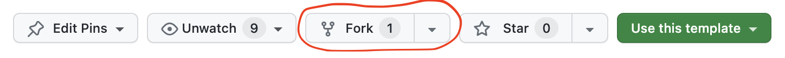
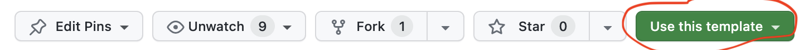
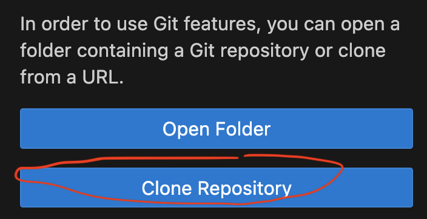

# ros2-teaching-ws
A template repository for teaching robotics with ROS2

## Use case

You can use this repository to start developing your ROS2 modules. It provides a preconfigured [Development Container](https://containers.dev/) with ROS2 installed, and a VNC based light Desktop integrated directly.

## Usage

This is a repository template, ready for you to either *fork* it (being able to pull in changes that happen in this repository later, recommended) or *use this template* to create your own independent repository.

### Option 1: How to *fork* (recommended)

Go to https://github.com/LCAS/ros2-teaching-ws and click on 

 

to create a GitHub Fork in your own GitHub account. Then continue to [clone](https://docs.github.com/en/repositories/creating-and-managing-repositories/cloning-a-repository) this repository on your computer. Learn more about GitHub Forks [here](https://docs.github.com/en/pull-requests/collaborating-with-pull-requests/working-with-forks/fork-a-repo).

### Option 2: How to *use as template*

Go to https://github.com/LCAS/ros2-teaching-ws and click on 

to create a new repository in your own GitHub account. Then continue to [clone](https://docs.github.com/en/repositories/creating-and-managing-repositories/cloning-a-repository) this repository on your computer. *Note: This repository is detached from the original one, so any changes in https://github.com/LCAS/ros2-teaching-ws happening after you created your own repository will have to be manually added.

### Setup your working environment

1. Make sure you have VSCode installed: https://code.visualstudio.com/download
2. Make sure you have the `Docker` and the `Dev Containers` extension in VSCode installed and working: https://code.visualstudio.com/docs/containers/overview and https://code.visualstudio.com/docs/devcontainers/containers
    * ensure docker is working, i.e. try `docker run --rm hello-world` and check it succeeds for your user
3. The docker image used to provide the Development Container is provided by the [L-CAS](https://lcas.lincoln.ac.uk) Container Registry. You must log in to use it. For simple read access, the username and password is public and is username `lcas`, password: `lincoln`. So, to log in do `docker login -u lcas -p lincoln lcas.lincoln.ac.uk` (you should only have to do this once, as the credentials should be cached unless your home directory is wiped).

### Open in VSCode

1. Open your own repository (*forked* or generated from this template) in VSCode: https://code.visualstudio.com/docs/sourcecontrol/intro-to-git (or any other way you prefer), e.g. click on "Clone Respository" in VSCode:
    

2. VSCode should prompt you that there is a devcontainer configured and ask if you want to reopen in container. Re-open in the container

### Access the embedded lite Desktop

1. Click on the "Port" in VSCode, find the "novnc" port, right click on it to open the menu, and then choose either "Open in Browser" to open it outside of VSCode or "Preview in Editor" to have it open within VSCode:

   

2. (recommended) Set the dekstop scaling by clicking on the settings cog and choose scaling mode "Remote Resizing" if it's not set

   

3. click on "Connect" and enter the password `vscode` when prompted:

   

